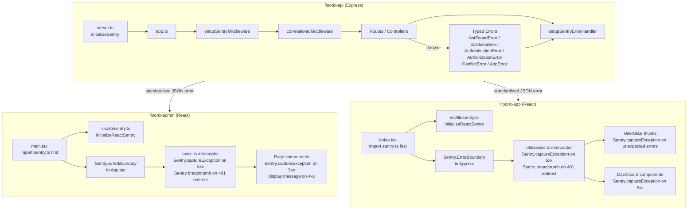

# Design Document: error-utils-integration

## Overview

This integration wires `@dotevolve/error-utils` consistently across three repositories:

- **floorix-api** — Express.js backend (Node.js, TypeScript/JS)
- **floorix-admin** — React + Vite super-admin frontend (TypeScript)
- **floorix-app** — React + Vite factory-operator frontend (TypeScript/JS)

The goal is a single, observable error model: every error is typed, every system error reaches Sentry, and every API error response follows the same JSON shape. The `@dotevolve/error-utils` package is the sole source of truth for error classes, Sentry initialisation, and Express middleware.

### Current State

| Repo | Sentry init | Error classes | Middleware order | Axios interceptor |
|---|---|---|---|---|
| API | ✅ `initializeSentry` in `server.ts` | ✅ Typed errors in controllers | ✅ Correct order in `app.ts` | N/A |
| Admin | ✅ `initializeReactSentry` in `src/lib/sentry.ts` | ❌ No Sentry capture in interceptor | ✅ `ErrorBoundary` in `App.tsx` | ❌ Missing Sentry capture on 5xx/refresh failure |
| Client | ❌ Raw `Sentry.init` in `index.tsx` (not using `initializeReactSentry`) | ❌ No Sentry capture in interceptor or thunks | ❌ No `ErrorBoundary` | ❌ Missing Sentry capture |

### Design Goals

1. Bring all three repos to full compliance with the 17 requirements.
2. Minimise changes — the API is largely compliant; Admin and Client need the most work.
3. All Sentry captures must include the `correlationId` from the standardised error response where available.

---

## Architecture



### Middleware Ordering (API)

The ordering in `app.ts` is already correct and must be preserved:

```
setupSentryMiddleware(app)   ← must be first (Sentry request handler + tracing)
correlationIdMiddleware       ← generates X-Correlation-Id
... body parsers, CORS, routes ...
setupSentryErrorHandler(app) ← must be last (Sentry error handler + custom error response)
```

---

## Components and Interfaces

### API Components

**`server.ts`** — Entry point. Calls `initializeSentry` before `require('./app')`. Already compliant; needs `release` field added.

**`app.ts`** — Express app. Already has correct middleware order. The catch-all `app.all` currently throws a plain `new Error(...)` — this must be replaced with `new NotFoundError`.

**Controllers** — All use `asyncHandler` and typed errors via `handlerFactory.js`. Individual controllers (`authController.js`, etc.) already import from `@dotevolve/error-utils/express`. The `attachSentryContext` call for authenticated requests needs to be added.

**`middleware/errorHandler` (from error-utils)** — Handles all `AppError` subclasses, formats the standardised response, and skips Sentry capture for `ValidationError`.

### Admin Components

**`src/lib/sentry.ts`** — Already calls `initializeReactSentry`. Needs `VITE_SENTRY_DSN` read from env (currently has DSN hardcoded).

**`src/main.tsx`** — Already imports `./lib/sentry` as first import. Compliant.

**`src/App.tsx`** — Already wraps tree in `Sentry.ErrorBoundary`. Compliant.

**`src/lib/axios.ts`** — Needs Sentry capture added:
- On 5xx responses: `Sentry.captureException` with `correlationId` tag
- On refresh failure: `Sentry.captureException` before redirect

**Page components** (`Dashboard.tsx`, `Tenants.tsx`, `Plans.tsx`) — Need Sentry capture on 5xx errors; display `error.message` from standardised response on 4xx.

### Client Components

**`src/lib/sentry.ts`** — New file. Calls `initializeReactSentry` with `VITE_SENTRY_DSN`.

**`src/index.tsx`** — Replace raw `Sentry.init` with `import './lib/sentry'` as first import.

**`src/App.tsx`** — Wrap root tree with `Sentry.ErrorBoundary`.

**`src/utils/axios.ts`** — Needs Sentry capture:
- On 5xx responses: `Sentry.captureException`
- On refresh failure: `Sentry.addBreadcrumb` for session expiry, then reject

**`src/Features/UserSlice/UserSlice.js`** — `loginUser` thunk needs `Sentry.captureException` for unexpected (non-4xx) errors.

**Dashboard components** — Need Sentry capture on 5xx; display `error.message` on 4xx.

---

## Data Models

### Standardised Error Response (from error-utils)

All API errors follow this shape, produced by `setupSentryErrorHandler`:

```typescript
interface ErrorResponse {
  success: false;
  error: {
    code: string;           // e.g. "not_found", "validation"
    category: string;       // same as code
    message: string;        // human-readable message
    correlationId: string;  // X-Correlation-Id value
    details?: Record<string, string[]>; // ValidationError field details
  };
  timestamp: string;        // ISO 8601
}
```

### Typed Error Classes (from `@dotevolve/error-utils`)

| Class | HTTP Status | Sentry Captured | Use Case |
|---|---|---|---|
| `ValidationError` | 400 | ❌ No | Invalid user input, field-level errors |
| `AuthenticationError` | 401 | ✅ Yes | Missing/invalid token |
| `AuthorizationError` | 403 | ✅ Yes | Insufficient permissions |
| `NotFoundError` | 404 | ✅ Yes | Resource not found |
| `ConflictError` | 409 | ✅ Yes | Duplicate resource, constraint violation |
| `AppError` | configurable | ✅ Yes | Generic system errors |

### Sentry Context Shape (API)

When `attachSentryContext` is called for authenticated requests:

```typescript
interface SentryUserContext {
  id: string;    // user._id
  role: string;  // user.role
}

interface SentryRequestTags {
  correlationId: string; // from req.headers['x-correlation-id']
}
```

### Environment Variables

| Variable | Repo | Required | Description |
|---|---|---|---|
| `SENTRY_DSN` | API | Yes | Sentry DSN for Node.js |
| `NODE_ENV` | API | Yes | `development` / `production` |
| `SENTRY_ENVIRONMENT` | API | No | Overrides `NODE_ENV` for Sentry |
| `VITE_SENTRY_DSN` | Admin | Yes | Sentry DSN for React (Vite) |
| `VITE_SENTRY_DSN` | Client | Yes | Sentry DSN for React (Vite) |

---

## Correctness Properties


*A property is a characteristic or behavior that should hold true across all valid executions of a system — essentially, a formal statement about what the system should do. Properties serve as the bridge between human-readable specifications and machine-verifiable correctness guarantees.*

### Property 1: Correlation ID present on all responses

*For any* HTTP request to the API, the response SHALL include an `X-Correlation-Id` header with a non-empty string value.

**Validates: Requirements 2.4**

### Property 2: Typed error → correct HTTP status

*For any* typed error class thrown in an API route handler (`ValidationError`, `AuthenticationError`, `AuthorizationError`, `NotFoundError`, `ConflictError`, `AppError`), the HTTP response status code SHALL match the error class's defined status (400, 401, 403, 404, 409, or the configured code respectively).

**Validates: Requirements 3.2, 3.3, 3.4, 3.5, 3.6, 4.3**

### Property 3: Standardised error response shape

*For any* error thrown in an API route handler, the response body SHALL conform to `{ success: false, error: { code, category, message, correlationId }, timestamp }`. When the error is a `ValidationError`, the body SHALL additionally include `error.details` with field-level information.

**Validates: Requirements 4.1, 4.2**

### Property 4: ValidationError is not captured in Sentry

*For any* `ValidationError` thrown in an API route handler, `Sentry.captureException` SHALL NOT be called for that error event.

**Validates: Requirements 5.3**

### Property 5: Admin Axios interceptor captures 5xx errors in Sentry with correlationId

*For any* Axios response error with a 5xx status code received by the Admin app, `Sentry.captureException` SHALL be called and the call SHALL include the `correlationId` extracted from the response body as a Sentry tag or extra context.

**Validates: Requirements 8.1, 8.2**

### Property 6: Admin page components display 4xx error messages from standardised response

*For any* API call in an Admin page component that fails with a 4xx status, the displayed error message SHALL equal the `error.message` field from the standardised error response body.

**Validates: Requirements 9.2**

### Property 7: Client Axios interceptor captures 5xx errors in Sentry

*For any* Axios response error with a 5xx status code received by the Client app, `Sentry.captureException` SHALL be called.

**Validates: Requirements 12.1**

### Property 8: Redux thunk errors are captured in Sentry

*For any* error caught in a Redux async thunk (e.g. `loginUser`) that is not a 4xx user error, `Sentry.captureException` SHALL be called before the rejected action is dispatched.

**Validates: Requirements 13.1, 13.2**

### Property 9: Client dashboard components display 4xx error messages from standardised response

*For any* API call in a Client dashboard component that fails with a 4xx status, the displayed error message SHALL equal the `error.message` field from the standardised error response body.

**Validates: Requirements 14.2**

---

## Error Handling

### API Error Flow

```
Route handler throws Typed_Error
  → asyncHandler catches it and calls next(err)
  → setupSentryErrorHandler middleware receives err
    → if err is ValidationError: skip Sentry capture, format response
    → if err is other AppError subclass: capture to Sentry with correlationId tag, format response
    → if err is unknown Error: wrap as AppError(500), capture to Sentry, format response
  → Response: { success: false, error: { code, category, message, correlationId }, timestamp }
```

### API — Catch-All Route Fix

The current catch-all in `app.ts` uses a plain `new Error(...)`:

```typescript
// Current (non-compliant):
app.all(/(.*)/, (req, res, next) => {
  next(new Error(`Can't find ${req.originalUrl} in this server!`));
});

// Required:
app.all(/(.*)/, (req, res, next) => {
  next(new NotFoundError('Route', req.originalUrl));
});
```

### API — Sentry Context Enrichment

`attachSentryContext` should be called in the `protect` middleware after `req.user` is set, or in a dedicated middleware that runs after authentication:

```typescript
// In authController.js protect function, after req.user = freshUser:
attachSentryContext({ user: { id: freshUser._id.toString(), role: freshUser.role } });
```

### Admin — Axios Interceptor Error Handling

The response interceptor needs to distinguish 5xx from 4xx and capture accordingly:

```typescript
// In src/lib/axios.ts response error handler:
const status = error.response?.status;
const correlationId = error.response?.data?.error?.correlationId;

if (status && status >= 500) {
  Sentry.captureException(error, {
    tags: { correlationId },
    extra: { url: error.config?.url, status },
  });
}
// On refresh failure:
Sentry.captureException(refreshError, { tags: { context: 'token_refresh_failure' } });
```

### Admin — Sentry DSN from Environment

The hardcoded DSN in `src/lib/sentry.ts` must be replaced:

```typescript
initializeReactSentry({
  dsn: import.meta.env.VITE_SENTRY_DSN,
  // ...
});
```

### Client — Sentry Initialisation Migration

Replace the raw `Sentry.init` in `index.tsx` with a dedicated `src/lib/sentry.ts`:

```typescript
// src/lib/sentry.ts
import { initializeReactSentry } from '@dotevolve/error-utils/react';

if (!import.meta.env.VITE_SENTRY_DSN) {
  console.warn('[Sentry] VITE_SENTRY_DSN is not set. Sentry error capture is disabled.');
}

initializeReactSentry({
  dsn: import.meta.env.VITE_SENTRY_DSN,
  environment: import.meta.env.MODE,
  tracesSampleRate: 1.0,
  replaysSessionSampleRate: 0.1,
  replaysOnErrorSampleRate: 1.0,
});
```

### Client — Axios Interceptor Error Handling

```typescript
// In src/utils/axios.ts response error handler:
import * as Sentry from '@sentry/react';

const status = error.response?.status;
if (status && status >= 500) {
  Sentry.captureException(error, {
    extra: { url: error.config?.url, status },
  });
}
// On 401 redirect:
Sentry.addBreadcrumb({
  category: 'auth',
  message: 'Session expired — redirecting to login',
  level: 'warning',
});
```

### Client — UserSlice Thunk Error Handling

```typescript
export const loginUser = createAsyncThunk('user/loginUser', async (user, thunkApi) => {
  try {
    const resp = await customFetch.post('/auth/login', user);
    // ...
  } catch (error) {
    const status = error.response?.status;
    // Only capture unexpected (non-4xx) errors to Sentry
    if (!status || status >= 500) {
      Sentry.captureException(error, { tags: { thunk: 'loginUser' } });
    }
    return thunkApi.rejectWithValue(
      error.response?.data?.error?.message || 'Invalid credentials'
    );
  }
});
```

### Missing DSN Warning Pattern

Both API and React apps should warn when DSN is absent:

```typescript
// API (server.ts):
if (!process.env.SENTRY_DSN) {
  console.warn('[Sentry] SENTRY_DSN is not set. Sentry error capture is disabled.');
}

// React (src/lib/sentry.ts):
if (!import.meta.env.VITE_SENTRY_DSN) {
  console.warn('[Sentry] VITE_SENTRY_DSN is not set. Sentry error capture is disabled.');
}
```

---

## Testing Strategy

### Dual Testing Approach

Both unit tests and property-based tests are required. Unit tests cover specific examples and edge cases; property-based tests verify universal correctness across many generated inputs.

### Property-Based Testing Library

- **API (Node.js)**: [fast-check](https://github.com/dubzzz/fast-check) — integrates with Jest/Vitest
- **Admin / Client (React)**: [fast-check](https://github.com/dubzzz/fast-check) — integrates with Vitest

Each property test must run a minimum of **100 iterations**.

Each property test must be tagged with a comment in this format:
```
// Feature: error-utils-integration, Property N: <property_text>
```

### Property Test Implementations

**Property 1 — Correlation ID on all responses**
```typescript
// Feature: error-utils-integration, Property 1: X-Correlation-Id present on all responses
it.prop([fc.string(), fc.string()])('every response has X-Correlation-Id', async (method, path) => {
  const res = await request(app)[method](`/api/v1/${path}`);
  expect(res.headers['x-correlation-id']).toBeDefined();
  expect(res.headers['x-correlation-id']).not.toBe('');
});
```

**Property 2 — Typed error → correct HTTP status**
```typescript
// Feature: error-utils-integration, Property 2: typed error maps to correct HTTP status
it.prop([fc.constantFrom(
  [new ValidationError('bad'), 400],
  [new AuthenticationError(), 401],
  [new AuthorizationError(), 403],
  [new NotFoundError('X', '1'), 404],
  [new ConflictError('dup'), 409],
)])('typed error produces correct status', async ([error, expectedStatus]) => {
  // Mount a test route that throws the error, verify response status
  expect(response.status).toBe(expectedStatus);
});
```

**Property 3 — Standardised error response shape**
```typescript
// Feature: error-utils-integration, Property 3: error response conforms to standard shape
it.prop([fc.constantFrom(...typedErrors)])('error response has standard shape', async (error) => {
  const body = response.body;
  expect(body.success).toBe(false);
  expect(body.error).toHaveProperty('code');
  expect(body.error).toHaveProperty('category');
  expect(body.error).toHaveProperty('message');
  expect(body.error).toHaveProperty('correlationId');
  expect(body).toHaveProperty('timestamp');
});
```

**Property 4 — ValidationError not captured in Sentry**
```typescript
// Feature: error-utils-integration, Property 4: ValidationError is not captured in Sentry
it.prop([fc.string({ minLength: 1 })])('ValidationError skips Sentry capture', async (msg) => {
  const captureSpy = jest.spyOn(Sentry, 'captureException');
  // Trigger a route that throws ValidationError
  expect(captureSpy).not.toHaveBeenCalled();
});
```

**Property 5 — Admin Axios interceptor captures 5xx with correlationId**
```typescript
// Feature: error-utils-integration, Property 5: Admin Axios 5xx captured in Sentry with correlationId
it.prop([fc.integer({ min: 500, max: 599 }), fc.uuid()])('5xx captured with correlationId', async (status, correlationId) => {
  // Mock axios response with given status and correlationId in body
  // Verify Sentry.captureException called with correlationId tag
});
```

**Property 6 — Admin page displays 4xx error.message**
```typescript
// Feature: error-utils-integration, Property 6: Admin page displays 4xx error.message
it.prop([fc.integer({ min: 400, max: 499 }), fc.string({ minLength: 1 })])('4xx shows error.message', async (status, message) => {
  // Mock API response with given status and error.message
  // Render page component, verify displayed text matches message
});
```

**Property 7 — Client Axios interceptor captures 5xx**
```typescript
// Feature: error-utils-integration, Property 7: Client Axios 5xx captured in Sentry
it.prop([fc.integer({ min: 500, max: 599 })])('5xx captured in Sentry', async (status) => {
  // Mock axios response with given status
  // Verify Sentry.captureException called
});
```

**Property 8 — Redux thunk errors captured in Sentry**
```typescript
// Feature: error-utils-integration, Property 8: thunk unexpected errors captured in Sentry
it.prop([fc.integer({ min: 500, max: 599 })])('thunk 5xx captured in Sentry', async (status) => {
  // Mock customFetch to reject with given status
  // Dispatch loginUser, verify Sentry.captureException called
});
```

**Property 9 — Client dashboard displays 4xx error.message**
```typescript
// Feature: error-utils-integration, Property 9: Client dashboard displays 4xx error.message
it.prop([fc.integer({ min: 400, max: 499 }), fc.string({ minLength: 1 })])('4xx shows error.message', async (status, message) => {
  // Mock API response with given status and error.message
  // Render dashboard component, verify displayed text matches message
});
```

### Unit Tests

Unit tests should cover:
- Specific examples: login with wrong credentials returns 401 with `AuthenticationError` shape
- Edge cases: missing `SENTRY_DSN` logs a warning and does not throw
- Edge cases: `ValidationError` with field details includes `details` in response body
- Edge cases: 401 refresh failure triggers Sentry capture and redirect
- Integration: `X-Correlation-Id` from request is echoed in response and error body
- Integration: `attachSentryContext` is called with user id and role on authenticated routes

### Test Configuration

```typescript
// vitest.config.ts (API)
export default defineConfig({
  test: {
    environment: 'node',
    // fast-check default runs 100 iterations; increase for critical properties
  },
});
```
