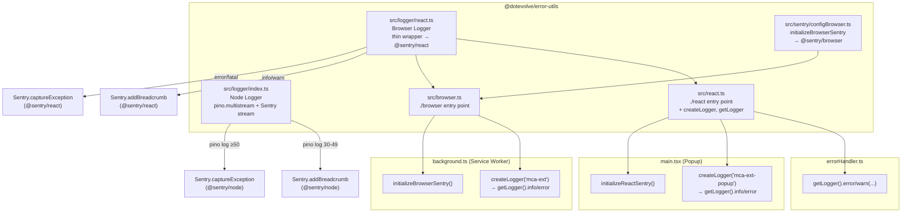

# Design Document: sentry-pino-logging

## Overview

This feature enhances `@dotevolve/error-utils` with Sentry-forwarding structured logging for both Node.js (via Pino multistream) and browser/React contexts (via a thin Sentry wrapper), and then applies those utilities to `govnix-mca-extension`.

### Current State

| Location | Problem |
|---|---|
| `src/logger/index.ts` | Plain Pino singleton — no Sentry forwarding. Developers must call Sentry APIs manually. |
| `src/react.ts` | No logger exports. React apps have no shared logging primitive. |
| `src/browser.ts` | Does not exist. No `./browser` entry point. |
| `src/sentry/configBrowser.ts` | Does not exist. No Service Worker-safe Sentry initializer. |
| `background.ts` | Calls `Sentry.init` directly; has duplicate `sanitizeData`; uses `console.log`. |
| `main.tsx` | Calls `Sentry.init` directly (second init in same extension). |
| `errorHandler.ts` | Calls `Sentry.captureException`/`addBreadcrumb` directly from `@sentry/browser`. |

### Design Goals

1. Developers call `logger.error(...)` — Sentry exceptions happen automatically.
2. Developers call `logger.info(...)` / `logger.warn(...)` — Sentry breadcrumbs happen automatically.
3. The `./browser` entry point never bundles `@sentry/react` or `react`.
4. The extension service worker never initializes Sentry manually.
5. Content scripts remain completely untouched.

---

## Architecture



---

## Data Models

This section documents the TypeScript interfaces, types, and constants that form the data contracts for this feature. Implementation code lives in the components described below — these are the shapes.

### `LogMeta`

Open-ended structured context map passed as the first argument to any logger method.

```typescript
interface LogMeta {
  [key: string]: unknown;
}
```

### `BrowserLogger`

Shared logger interface implemented by both the Node logger (`src/logger/index.ts`) and the browser logger (`src/logger/react.ts`). This is the type returned by `createLogger` and `getLogger` in all contexts.

```typescript
interface BrowserLogger {
  debug(msg: string): void;
  debug(obj: LogMeta, msg: string): void;
  info(msg: string): void;
  info(obj: LogMeta, msg: string): void;
  warn(msg: string): void;
  warn(obj: LogMeta, msg: string): void;
  error(msg: string): void;
  error(obj: LogMeta | Error, msg?: string): void;
  fatal(msg: string): void;
  fatal(obj: LogMeta | Error, msg?: string): void;
  child(bindings: LogMeta): BrowserLogger;
}
```

### `BrowserSentryConfig`

Configuration passed to `initializeBrowserSentry`. Intentionally excludes replay, profiling, and React-specific fields to keep the `./browser` entry point safe for Service Worker contexts.

```typescript
interface BrowserSentryConfig {
  dsn: string;
  serviceName?: string;        // default: "browser"
  environment?: string;        // default: "production"
  release?: string;
  tracesSampleRate?: number;   // default: 1.0
  sensitiveFields?: string[];  // additional fields to redact
}
```

### Pino → Sentry level map

The numeric Pino level values and their mapped Sentry `SeverityLevel` strings. This constant lives in `src/logger/index.ts` and drives the Sentry stream routing logic.

| Pino level | Numeric value | Sentry SeverityLevel |
|---|---|---|
| trace | 10 | `debug` |
| debug | 20 | `debug` |
| info | 30 | `info` |
| warn | 40 | `warning` |
| error | 50 | `error` |
| fatal | 60 | `fatal` |

**Routing rules**: levels ≥ 50 → `captureException`; levels 30–49 → `addBreadcrumb`; levels < 30 → silent (no Sentry call).

---

## Components and Interfaces

### `src/types/logger.ts` (new)

A shared logger interface so `src/logger/index.ts` and `src/logger/react.ts` can both satisfy the same type contract without either importing the other.

```typescript
export interface LogMeta {
  [key: string]: unknown;
}

export interface BrowserLogger {
  debug(msg: string): void;
  debug(obj: LogMeta, msg: string): void;
  info(msg: string): void;
  info(obj: LogMeta, msg: string): void;
  warn(msg: string): void;
  warn(obj: LogMeta, msg: string): void;
  error(msg: string): void;
  error(obj: LogMeta | Error, msg?: string): void;
  fatal(msg: string): void;
  fatal(obj: LogMeta | Error, msg?: string): void;
  child(bindings: LogMeta): BrowserLogger;
}
```

The existing `noopLogger` in `src/logger/index.ts` will be cast to `BrowserLogger` (instead of `Logger`) so it can serve as the fallback for both the Node and browser singletons.

---

### `src/logger/index.ts` (modified)

Key change: replace plain `pino(...)` with `pino({ ...options }, pino.multistream([stdoutStream, sentryStream]))`.

#### Sentry stream implementation

```typescript
import { Writable } from "stream";
import * as Sentry from "@sentry/node";

const PINO_TO_SENTRY_LEVEL: Record<number, Sentry.SeverityLevel> = {
  10: "debug",
  20: "debug",
  30: "info",
  40: "warning",
  50: "error",
  60: "fatal",
};

function createSentryStream(): Writable {
  return new Writable({
    write(chunk: Buffer, _encoding, callback) {
      try {
        const record = JSON.parse(chunk.toString());
        const { level, msg, err, ...extra } = record;
        const sentryLevel = PINO_TO_SENTRY_LEVEL[level] ?? "info";

        if (level >= 50) {
          // Pino serializes errors as plain objects { message, stack, type },
          // not actual Error instances. Check for the serialized shape.
          const error =
            err && typeof err === "object" && "message" in err
              ? new Error((err as { message: string }).message)
              : new Error(msg ?? "Unknown error");
          Sentry.captureException(error, { level: sentryLevel, extra });
        } else if (level >= 30) {
          Sentry.addBreadcrumb({
            message: msg,
            level: sentryLevel,
            data: extra,
          });
        }
        // level < 30 (debug/trace): no Sentry call
      } catch {
        // Swallow JSON parse errors — never let a log failure crash the app
      }
      callback();
    },
  });
}
```

The return type of `createLogger` changes from `Logger` (pino) to `BrowserLogger` to match the shared interface. The noop logger is cast to `BrowserLogger`.

---

### `src/logger/react.ts` (new)

Thin Sentry wrapper that satisfies `BrowserLogger` without importing pino. Uses `@sentry/react` exclusively.

```typescript
import * as Sentry from "@sentry/react";
import type { BrowserLogger, LogMeta } from "../types/logger";

function createBrowserLogger(serviceName: string, bindings: LogMeta = {}): BrowserLogger {
  const buildExtra = (obj?: LogMeta | Error | string): LogMeta => ({
    service: serviceName,
    ...bindings,
    ...(obj && typeof obj === "object" && !(obj instanceof Error) ? (obj as LogMeta) : {}),
  });

  return {
    debug(obj: LogMeta | string, msg?: string) {
      const message = typeof obj === "string" ? obj : (msg ?? "");
      console.debug(`[${serviceName}]`, message, typeof obj === "object" ? obj : "");
    },
    info(obj: LogMeta | string, msg?: string) {
      const message = typeof obj === "string" ? obj : (msg ?? "");
      console.info(`[${serviceName}]`, message);
      Sentry.addBreadcrumb({ message, level: "info", data: buildExtra(obj as LogMeta) });
    },
    warn(obj: LogMeta | string, msg?: string) {
      const message = typeof obj === "string" ? obj : (msg ?? "");
      console.warn(`[${serviceName}]`, message);
      Sentry.addBreadcrumb({ message, level: "warning", data: buildExtra(obj as LogMeta) });
    },
    error(obj: LogMeta | Error | string, msg?: string) {
      const message = typeof obj === "string" ? obj : (msg ?? "");
      const error = obj instanceof Error ? obj : new Error(message);
      console.error(`[${serviceName}]`, message, obj);
      Sentry.captureException(error, { extra: buildExtra(obj) });
    },
    fatal(obj: LogMeta | Error | string, msg?: string) {
      const message = typeof obj === "string" ? obj : (msg ?? "");
      const error = obj instanceof Error ? obj : new Error(message);
      console.error(`[${serviceName}][FATAL]`, message, obj);
      Sentry.captureException(error, { level: "fatal", extra: buildExtra(obj) });
    },
    child(childBindings: LogMeta): BrowserLogger {
      return createBrowserLogger(serviceName, { ...bindings, ...childBindings });
    },
  };
}

const noopLogger: BrowserLogger = {
  debug: () => {},
  info: () => {},
  warn: () => {},
  error: () => {},
  fatal: () => {},
  child: () => noopLogger,
};

let singleton: BrowserLogger | null = null;

export function createLogger(serviceName: string): BrowserLogger {
  singleton = createBrowserLogger(serviceName);
  return singleton;
}

export function getLogger(): BrowserLogger {
  return singleton ?? noopLogger;
}
```

---

### `src/sentry/configBrowser.ts` (new)

`@sentry/browser`-based initializer for non-React browser contexts (Chrome Extension Service Workers). No replay, no profiling, no React integrations.

```typescript
import * as Sentry from "@sentry/browser";
import { sanitizeData, sanitizeUrl } from "../utils/sanitizer";
import { createLogger } from "../logger/react";

export interface BrowserSentryConfig {
  dsn: string;
  serviceName?: string;
  environment?: string;
  release?: string;
  tracesSampleRate?: number;
  sensitiveFields?: string[];
}

export function initializeBrowserSentry(config: BrowserSentryConfig): typeof Sentry {
  const {
    dsn,
    serviceName = "browser",
    environment = "production",
    release,
    tracesSampleRate = 1.0,
    sensitiveFields = [],
  } = config;

  Sentry.init({
    dsn,
    environment,
    release,
    tracesSampleRate,
    integrations: [Sentry.browserTracingIntegration()],

    beforeSend(event) {
      if (event.request?.data) {
        event.request.data = sanitizeData(event.request.data, sensitiveFields);
      }
      if (event.extra) {
        event.extra = sanitizeData(
          event.extra as Record<string, unknown>,
          sensitiveFields,
        ) as typeof event.extra;
      }
      return event;
    },

    beforeBreadcrumb(breadcrumb) {
      if (breadcrumb.category === "http" && breadcrumb.data?.url) {
        breadcrumb.data.url = sanitizeUrl(breadcrumb.data.url as string);
      }
      if (breadcrumb.data) {
        breadcrumb.data = sanitizeData(breadcrumb.data, sensitiveFields);
      }
      return breadcrumb;
    },
  });

  // Mirror initializeSentry pattern: initialise the logger singleton immediately
  createLogger(serviceName);

  return Sentry;
}
```

---

### `src/browser.ts` (new)

New `./browser` entry point. Must not import or re-export anything from `@sentry/react` or `./sentry/configReact`.

```typescript
// Error classes
export {
  AppError,
  ValidationError,
  AuthenticationError,
  AuthorizationError,
  NotFoundError,
  ConflictError,
} from "./errors/AppError";

export { ErrorCategory } from "./errors/ErrorCategory";
export type { ErrorCategoryType } from "./errors/ErrorCategory";

// Browser Sentry initializer (uses @sentry/browser — safe for Service Workers)
export { initializeBrowserSentry } from "./sentry/configBrowser";
export type { BrowserSentryConfig } from "./sentry/configBrowser";

// Browser logger (no pino — safe for all browser contexts)
export { createLogger, getLogger } from "./logger/react";
export type { BrowserLogger, LogMeta } from "./types/logger";

// Utilities
export { sanitizeData, sanitizeUrl } from "./utils/sanitizer";
```

---

### `src/react.ts` (modified)

Add logger exports below the existing ones. All existing exports remain unchanged.

```typescript
// Error classes
export {
  AppError,
  ValidationError,
  AuthenticationError,
  AuthorizationError,
  NotFoundError,
  ConflictError,
} from "./errors/AppError";

export { ErrorCategory } from "./errors/ErrorCategory";
export type { ErrorCategoryType } from "./errors/ErrorCategory";

// React Sentry configuration
export { initializeReactSentry } from "./sentry/configReact";
export type { ReactSentryConfig } from "./sentry/configReact";

// Utilities
export { sanitizeData, sanitizeUrl } from "./utils/sanitizer";

// Logger (browser-safe, no pino)
export { createLogger, getLogger } from "./logger/react";
export type { BrowserLogger, LogMeta } from "./types/logger";

export * as Sentry from "@sentry/react";
```

---

### `package.json` (modified)

Three changes:

1. Bump version from `1.0.10` to `1.0.11`.
2. Add `"@sentry/browser": "^10.46.0"` to `dependencies`.
3. Add the `./browser` export using the CJS-only format (build tool is plain `tsc` producing CommonJS):

```json
{
  "version": "1.0.11",
  "exports": {
    ".": {
      "types": "./dist/index.d.ts",
      "require": "./dist/index.js"
    },
    "./node": {
      "types": "./dist/node.d.ts",
      "require": "./dist/node.js"
    },
    "./express": {
      "types": "./dist/express.d.ts",
      "require": "./dist/express.js"
    },
    "./react": {
      "types": "./dist/react.d.ts",
      "require": "./dist/react.js"
    },
    "./browser": {
      "types": "./dist/browser.d.ts",
      "require": "./dist/browser.js"
    }
  },
  "dependencies": {
    "@sentry/browser": "^10.46.0",
    "@sentry/node": "^10.46.0",
    "@sentry/profiling-node": "^10.46.0",
    "@sentry/react": "^10.46.0",
    "pino": "^10.3.1"
  }
}
```

Note: The existing exports use `"import"` + `"require"` keys but the build tool is plain `tsc` producing CommonJS only. The `./browser` export uses `"require"` only to match the actual output format. The existing entries can remain as-is since `dist/*.js` files satisfy both keys.

---

## Extension Migration

### `govnix-mca-extension/src/background.ts` (modified)

#### Before

```typescript
import * as Sentry from "@sentry/browser";

Sentry.init({
  dsn: "...",
  environment: "...",
  // ... inline config
});

function sanitizeData(data: Record<string, unknown>): Record<string, unknown> {
  // duplicate implementation
}

console.log("Extension initialized");
```

#### After

```typescript
import { initializeBrowserSentry, createLogger } from "@dotevolve/error-utils/browser";

initializeBrowserSentry({
  dsn: import.meta.env.VITE_SENTRY_DSN,
  environment: import.meta.env.MODE,
  release: import.meta.env.VITE_APP_VERSION,
  tracesSampleRate: 1.0,
  serviceName: "mca-extension-background",
});

const logger = createLogger("mca-extension-background");

// Replace every console.log(...) with logger.info(...)
logger.info("Extension initialized");
```

Changes:
- Import `initializeBrowserSentry` and `createLogger` from `@dotevolve/error-utils/browser`.
- Replace `Sentry.init(...)` with `initializeBrowserSentry(...)`.
- Remove the inline `sanitizeData` function entirely — sanitization is handled inside `initializeBrowserSentry`.
- Replace every `console.log(...)` call with `logger.info(...)`.
- Remove the direct `@sentry/browser` import.

---

### `govnix-mca-extension/src/main.tsx` (modified)

#### Before

```typescript
import * as Sentry from "@sentry/react";

Sentry.init({
  dsn: "...",
  // ... inline config
});
```

#### After

```typescript
import { initializeReactSentry, createLogger } from "@dotevolve/error-utils/react";

initializeReactSentry({
  dsn: import.meta.env.VITE_SENTRY_DSN,
  environment: import.meta.env.MODE,
  release: import.meta.env.VITE_APP_VERSION,
  tracesSampleRate: 1.0,
  replaysSessionSampleRate: 0.1,
  replaysOnErrorSampleRate: 1.0,
});

createLogger("govnix-mca-extension-popup");
```

Changes:
- Replace `import * as Sentry from "@sentry/react"; Sentry.init(...)` with `initializeReactSentry(...)`.
- Call `createLogger("govnix-mca-extension-popup")` to initialize the popup logger singleton.
- Remove direct `Sentry.init` call.

---

### `govnix-mca-extension/src/utils/errorHandler.ts` (modified)

#### Before

```typescript
import * as Sentry from "@sentry/browser";

class ExtensionErrorHandler {
  handle(error: unknown) {
    // network error
    Sentry.captureException(error, {
      extra: { errorType: "network_error", source: "extension" },
    });

    // validation error — breadcrumb only
    Sentry.addBreadcrumb({
      message: errorResponse.error?.message,
      level: "warning",
    });

    // other backend errors
    Sentry.captureException(new Error(errorResponse.error?.message), {
      extra: { correlationId, category, code, status, url, method },
    });
  }
}
```

#### After

```typescript
import { getLogger } from "@dotevolve/error-utils/react";

class ExtensionErrorHandler {
  handle(error: unknown) {
    // network error
    getLogger().error(
      { errorType: "network_error", source: "extension" },
      (error as Error).message ?? "Network error",
    );

    // validation error — produces Sentry breadcrumb (not exception)
    getLogger().warn(
      { correlationId, category, code },
      errorResponse.error?.message,
    );

    // other backend errors
    getLogger().error(
      { correlationId, category, code, status, url, method },
      errorResponse.error?.message,
    );
  }
}
```

Changes:
- Import `getLogger` from `@dotevolve/error-utils/react` instead of `@sentry/browser`.
- Replace `Sentry.captureException(...)` calls with `getLogger().error(...)`.
- Replace `Sentry.addBreadcrumb(...)` for validation errors with `getLogger().warn(...)` — this preserves the existing intent (breadcrumb, not exception) because the browser logger maps `warn` to `Sentry.addBreadcrumb`.
- Remove the `@sentry/browser` import entirely.

---

### `govnix-mca-extension/package.json` (modified)

Add `@dotevolve/error-utils` as a regular dependency:

```json
{
  "dependencies": {
    "@dotevolve/error-utils": "^1.0.11"
  }
}
```

---

## Error Handling

### Sentry stream — JSON parse failures

The Pino Sentry stream's `write` callback wraps the entire body in a `try/catch`. If the log chunk is not valid JSON (e.g. a partial flush, a non-JSON message written to the same stream), the error is swallowed silently and `callback()` is still called. This is intentional: a logging failure must never crash the application.

```typescript
try {
  const record = JSON.parse(chunk.toString());
  // ... routing logic
} catch {
  // Swallow JSON parse errors — never let a log failure crash the app
}
callback(); // always call, even on error
```

### Sentry stream — Pino serialized error objects

Pino serializes `Error` instances into plain objects (`{ message, stack, type }`) before writing them to the stream. The stream must never attempt `instanceof Error` on the deserialized value — it will always be a plain object. Instead, the stream checks for the serialized shape:

```typescript
const error =
  err && typeof err === "object" && "message" in err
    ? new Error((err as { message: string }).message)
    : new Error(msg ?? "Unknown error");
```

### Browser logger — no-op fallback before initialization

`getLogger()` returns a no-op `BrowserLogger` if `createLogger` has never been called. Every method on the noop is a silent no-op — no Sentry calls, no console output, no throws. This prevents `getLogger().error(...)` calls at module load time (before `initializeBrowserSentry` runs) from crashing.

```typescript
const noopLogger: BrowserLogger = {
  debug: () => {},
  info: () => {},
  warn: () => {},
  error: () => {},
  fatal: () => {},
  child: () => noopLogger,
};
```

### Node logger — test environment guard

When `NODE_ENV === "test"`, `createLogger` returns the noop logger directly without constructing the Pino multistream or registering the Sentry stream. This prevents Sentry API calls and stdout noise during test runs.

### `initializeBrowserSentry` — `beforeSend` and `beforeBreadcrumb` never throw

The `beforeSend` and `beforeBreadcrumb` callbacks must not throw. They operate on potentially untrusted event shapes from `@sentry/browser`. Both callbacks guard with optional chaining (`?.`) before accessing nested properties. If a sanitization step fails, the event is returned as-is rather than dropped — losing sanitization is preferable to silently swallowing an error event.

### Extension migration — validation errors stay as breadcrumbs

The `ExtensionErrorHandler` migration preserves the existing intent for `ErrorCategory.VALIDATION` errors: these are downgraded to `getLogger().warn(...)` rather than `getLogger().error(...)`. Because `warn` maps to `Sentry.addBreadcrumb` (not `captureException`), validation errors continue to produce breadcrumbs only — consistent with the prior direct `Sentry.addBreadcrumb` call. This distinction is load-bearing and must not be changed to `error`.

---

## Testing Strategy

### New tests required

#### `src/__tests__/logger-browser.test.ts`

Unit tests for `src/logger/react.ts`:

- `createLogger` returns a `BrowserLogger` that satisfies the interface
- `getLogger` returns the noop logger before `createLogger` is called
- `getLogger` returns the singleton after `createLogger` is called
- `logger.info(msg)` calls `Sentry.addBreadcrumb` with `level: "info"`
- `logger.warn(msg)` calls `Sentry.addBreadcrumb` with `level: "warning"`
- `logger.error(msg)` calls `Sentry.captureException` with a wrapped `Error`
- `logger.error(errorInstance, msg)` passes the `Error` instance directly
- `logger.fatal(msg)` calls `Sentry.captureException` with `level: "fatal"`
- `logger.debug(msg)` calls `console.debug` only — no Sentry call
- `logger.child(bindings)` merges bindings into subsequent calls

Property test: for any `LogMeta` object and string message, `logger.error(meta, msg)` always calls `captureException` with an `Error` whose `message` equals `msg`.

#### `src/__tests__/configBrowser.test.ts`

Unit tests for `src/sentry/configBrowser.ts`:

- `initializeBrowserSentry` calls `Sentry.init` with the provided DSN and environment
- `initializeBrowserSentry` applies `browserTracingIntegration` only
- `initializeBrowserSentry` applies `beforeSend` sanitization for `event.request.data`
- `initializeBrowserSentry` applies `beforeBreadcrumb` sanitization for `breadcrumb.data`
- `initializeBrowserSentry` calls `createLogger(serviceName)` after init
- `initializeBrowserSentry` uses `"browser"` as default `serviceName`

#### Existing tests

All existing tests in `src/__tests__/` must continue to pass after the changes to `src/logger/index.ts`. In particular, the `NODE_ENV === "test"` guard must still return the noop logger without activating the multistream or Sentry stream.

---

## Correctness Properties

*A property is a characteristic or behavior that should hold true across all valid executions of a system — essentially, a formal statement about what the system should do. Properties serve as the bridge between human-readable specifications and machine-verifiable correctness guarantees.*

### Property 1: Error/fatal log levels always produce Sentry exceptions

*For any* call to `logger.error(...)` or `logger.fatal(...)` on a `BrowserLogger`, a `Sentry.captureException` call SHALL occur with an `Error` object.

**Validates: Requirements 1.2, 3.3**

### Property 2: Info/warn log levels always produce Sentry breadcrumbs

*For any* call to `logger.info(...)` or `logger.warn(...)` on a `BrowserLogger`, a `Sentry.addBreadcrumb` call SHALL occur with the correct mapped Sentry level (`"info"` or `"warning"`).

**Validates: Requirements 1.3, 3.4**

### Property 3: Debug log level never touches Sentry

*For any* call to `logger.debug(...)`, no Sentry API (`captureException`, `addBreadcrumb`) SHALL be called.

**Validates: Requirements 1.4, 3.5**

### Property 4: Error instance pass-through

*For any* `Error` instance passed as the first argument to `logger.error(errorInstance, msg)`, the same `Error` instance SHALL be passed directly to `Sentry.captureException` without being wrapped in a new `Error`.

**Validates: Requirements 2.2**

### Property 5: String-only call wraps in Error

*For any* string `msg` passed as the sole argument to `logger.error(msg)`, `Sentry.captureException` SHALL be called with `new Error(msg)`.

**Validates: Requirements 2.3**

### Property 6: Child logger inherits bindings

*For any* `BrowserLogger` with bindings `b1` and a child created with bindings `b2`, all log calls on the child SHALL include both `b1` and `b2` in the Sentry context `extra` data.

**Validates: Requirements 3.2**

### Property 7: Browser logger never imports pino

*For any* execution environment (Node.js or browser), importing `src/logger/react.ts` SHALL NOT trigger a `require("pino")` or `import("pino")` call.

**Validates: Requirements 3.8, 4.3**

### Property 8: Pino level to Sentry level mapping is exhaustive

*For any* Pino log record with a numeric `level` field in the range `[10, 20, 30, 40, 50, 60]`, the Sentry stream SHALL map it to a valid `SeverityLevel` value.

**Validates: Requirements 1.6**
